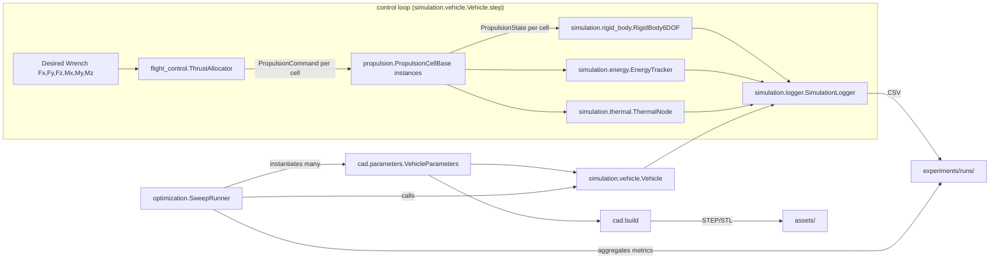

# Architecture

## Module map

```
cad/              Parametric CadQuery geometry (hull, plenum, nozzles, channels,
                   ribs, electronics mounts, propulsion interfaces).
simulation/        Hardware-independent physics: rigid body dynamics, propulsion
                   latency/loss surrogate, energy, thermal, data logging.
propulsion/        Plugin interface + registry. propulsion/cells/ holds one
                   module per technology; none are implemented yet.
flight_control/    Thrust allocation: desired wrench -> per-cell commands.
optimization/      Parameter space + sweep runner, technology/config agnostic.
firmware/          Future: embedded control code (unimplemented).
electronics/       Future: wiring harness / PCB design assets (unimplemented).
docs/              This documentation set.
research/          Hypotheses and open research questions.
experiments/        Dated experiment records with measured data.
scripts/           Entry points: run_sweep.py, generate_cad.py, new_experiment.py.
tests/             pytest suite covering every Python package above.
assets/            Static reference assets (images, exported models).
unreal/            Future: Unreal Engine visualization/simulation project.
```

Each Python package (`cad`, `simulation`, `propulsion`, `flight_control`,
`optimization`) is importable at the repository root (e.g. `import
propulsion`, not `import oryx.propulsion`) -- see `pyproject.toml`'s
`[tool.setuptools.packages.find]`.

## Data flow



## Key interfaces (the seams that must stay stable)

- **`propulsion.base.PropulsionCellSpec`** -- body-frame position + thrust
  direction + thrust limits. The one geometry contract shared by CAD
  (`cad.nozzle_array.NozzlePose`), flight control, and simulation.
- **`propulsion.base.PropulsionCellBase`** -- `command()` / `step()` /
  `response_time_s()` / `rated_power_w()`. Every propulsion technology,
  real or surrogate (`simulation.generic_propulsion.GenericPropulsionCell`),
  implements only this.
- **`flight_control.wrench.Wrench`** -- the six numbers (Fx, Fy, Fz, Mx,
  My, Mz) that fully describe what the flight controller wants, regardless
  of vehicle configuration.
- **`cad.parameters.VehicleParameters`** -- the entire parametric design
  vector; the thing `optimization.SweepRunner` varies and `cad.build`
  turns into geometry.

## Body / world frame convention

Body frame: origin at center of mass, +X forward, +Y right, +Z down.
World frame: fixed inertial frame, +Z down (so gravity is `+Z`). This
convention is used consistently by `propulsion.base`, `flight_control`,
`simulation.rigid_body`, and `cad.nozzle_array` -- if you add a module that
touches vehicle geometry or dynamics, match it rather than introducing a
new convention.

## Why a mixed top-level layout instead of a single `src/oryx` package

`cad/`, `simulation/`, `propulsion/`, `flight_control/`, and `optimization/`
are top-level importable packages, sitting alongside non-Python directories
like `docs/` and `experiments/`, per the repository structure this project
was scoped with (see [decision_log.md](decision_log.md), ADR-0004). The
tradeoff: these names are generic enough to collide with unrelated
top-level packages in a shared Python environment -- acceptable here since
ORYX is developed in its own virtual environment (`environment.yml` /
`pyproject.toml`).
